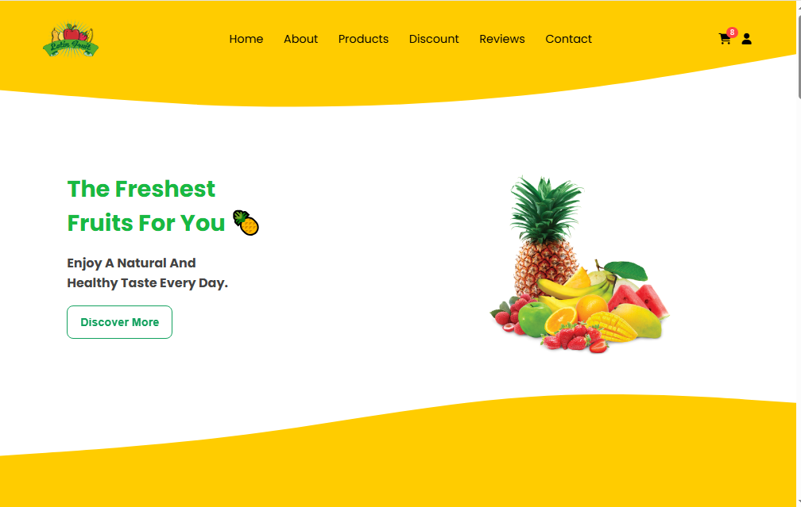

# 🍓 Fruits Website

<div align="center">

### 🍊 Fresh Fruits • Modern Design • Smooth Experience 🍍

A modern and responsive fruit shop website built with **HTML, CSS, and JavaScript**.



</div>

---

## ✨ About The Project

**Fruits Website** is a modern and responsive fruit shop website designed to provide a clean, attractive, and interactive shopping experience.

This project was built as a frontend learning and practice project, focusing on practical **HTML, CSS, and JavaScript** development.

---

## 🚀 Features

- 🍎 Interactive fruit product cards
- 🛒 Add and remove fruits from the shopping cart
- 💰 Automatic cart total calculation
- 🔎 Product details modal
- 🔐 Login page
- ⭐ Customer reviews carousel
- ✨ Smooth GSAP animations
- 💾 Local Storage for cart data
- 📱 Responsive design
- 🎨 Modern fruit-themed interface

---

## 🛠️ Technologies

<div align="center">


</div>

---

## 🎨 Design Highlights

- 🟢 Fresh green and orange color palette
- 🍊 Fruit-inspired visual elements
- ✨ Smooth hover effects and transitions
- 📱 Responsive layouts
- 🎯 Simple and user-friendly navigation
- 🛍️ Interactive shopping experience

---

## 🛒 Shopping Cart

The website includes an interactive shopping cart where users can:

- Add fruits
- Remove fruits
- View the number of items
- Calculate the total price
- Save cart data using Local Storage

---

## ⭐ Reviews

The website includes an interactive customer reviews carousel with navigation controls and mouse drag interaction.

---

## ✨ Animations

**GSAP** is used to create smooth animations across different sections of the website, including:

- Hero section
- Product cards
- Content sections
- Fruit elements
- Interactive UI elements

---

## 📱 Responsive Design

The website is designed to work across:

- 💻 Desktop
- 💻 Laptop
- 📱 Tablet
- 📱 Mobile

---

## 🎯 Project Goal

This project was created to strengthen practical frontend development skills through building a complete interactive website.

### Learning Focus

- HTML structure
- CSS layouts
- Responsive design
- JavaScript DOM manipulation
- JavaScript events
- Local Storage
- Dynamic content rendering
- Interactive UI components
- Modal functionality
- Shopping cart logic
- GSAP animations

---

## 🌱 Future Improvements

- 🔍 Product search and filtering
- 👤 Complete user authentication
- 💳 Checkout and payment integration
- 🧾 Order history
- 🗄️ Backend integration
- 🌐 Online database
- ❤️ Wishlist functionality
- 🛍️ Product categories

---
## 🚀 Getting Started

### Clone the Repository

```bash
git clone https://github.com/asmaaportfolio/fruits-website.git

Open the Project

Open the project folder in Visual Studio Code.

Run the Website

Open index.html using Live Server.

👩‍💻 Author
Asmaa Qandil

Frontend Developer & Learner

Built with ❤️, JavaScript, and lots of 🍓🍊🍍

<div align="center">
🍓 Eat Fresh. Stay Healthy. 🍓

⭐ If you like this project, consider giving it a star!

</div>


